<div align="center">



<br/>

<a href="#mission-log">MISSION</a> ·
<a href="#the-code-universe">UNIVERSE</a> ·
<a href="#discover-my-worlds">WORLDS</a> ·
<a href="#exploration-log">JOURNEY</a> ·
<a href="#tech-stack">STACK</a> ·
<a href="#transmit-a-message">CONTACT</a>

</div>

<br/>

> I don't just write code. I build systems that solve real-world problems.

<br/>

## Mission Log

```
MISSION LOG // 001
───────────────────────────────────────────
EXPLORER          Rishu Sharma
COORDINATES       LPU · India
CURRENT MISSION   Building intelligent software systems
SECTORS           Backend Engineering · Full Stack Development · AI/ML · Problem Solving
STATUS            ● EXPLORING
───────────────────────────────────────────
```

I'm an MCA student at Lovely Professional University, currently oriented toward **Full Stack Development, Backend Engineering, and applied AI/ML**. My work spans production web platforms, IoT hardware with on-device machine learning, and AI-powered tools — each one a small world charted along the way.

<br/>

## The Code Universe

<div align="center">

</div>

<br/>

## Discover My Worlds

<table>
<tr>
<td width="120" align="center">🪐</td>
<td>

### TalentIQ
**AI Recruitment Intelligence Platform**

An AI-powered recruitment platform built around a composite **Cognitive Fit Index™** scoring system, using semantic search over candidate data to help surface intelligent matches.

`React` `TypeScript` `Vite` `FastAPI` `Supabase PostgreSQL` `pgvector` `Google Gemini` `Sentence Transformers`

</td>
</tr>
</table>

<details>
<summary>🔭 Explore TalentIQ</summary>
<br/>

- **Core idea:** composite scoring (Cognitive Fit Index™) instead of keyword matching
- **Semantic layer:** pgvector-backed vector search over candidate embeddings
- **Stack:** React + TypeScript + Vite frontend, FastAPI backend, Supabase PostgreSQL
- **Repository:** `YOUR_GITHUB_URL/talentiq`

</details>

<br/>

<table>
<tr>
<td width="120" align="center">🪐</td>
<td>

### CityBrains
**Crowdsourced Civic Issue Reporting & Resolution Tracker**

A civic platform for reporting issues like potholes, garbage, and broken streetlights, with location-aware workflows, officer assignment, SLA tracking, notifications, public dashboards, and escalation. Built as a 5-member MERN team project.

`MongoDB Atlas` `Node.js` `Express.js` `React` `MERN`

</td>
</tr>
</table>

<details>
<summary>🔭 Explore CityBrains</summary>
<br/>

- **Core idea:** turn scattered civic complaints into a trackable, accountable pipeline
- **Workflow:** report → officer assignment → SLA tracking → resolution → public dashboard
- **Extras:** ward-level leaderboards and heatmaps of reported issues
- **Repository:** `YOUR_GITHUB_URL/citybrains`

</details>

<br/>

<table>
<tr>
<td width="120" align="center">🪐</td>
<td>

### AgriSmart
**AI Crop Recommendation Platform**

An AI-powered agricultural platform that recommends crops based on contextual, location-aware information.

`MERN` `Google Gemini` `Geolocation` `AI`

</td>
</tr>
</table>

<details>
<summary>🔭 Explore AgriSmart</summary>
<br/>

- **Core idea:** contextual, geolocation-aware crop recommendations
- **AI layer:** Gemini-powered reasoning over local agricultural context
- **Repository:** `YOUR_GITHUB_URL/agrismart`

</details>

<br/>

<table>
<tr>
<td width="120" align="center">🪐</td>
<td>

### LifeLink
**Blood Bank Inventory & Emergency Donor Matching System**

A desktop system for managing blood inventory and matching emergency donors quickly and reliably.

`Java` `Java Swing` `JDBC` `MySQL`

</td>
</tr>
</table>

<details>
<summary>🔭 Explore LifeLink</summary>
<br/>

- **Core idea:** fast, reliable donor matching under emergency time pressure
- **Stack:** Java Swing desktop client, JDBC, MySQL
- **Repository:** `YOUR_GITHUB_URL/lifelink`

</details>

<br/>

<table>
<tr>
<td width="120" align="center">🪐</td>
<td>

### Aeronex
**Wearable IoT Safety Prediction System**

A wearable IoT safety device for sewer workers, combining MQ-136 (H2S), Grove EC (O2), MAX30102 (SpO2/HR), and NEO-6M GPS sensors on an ESP32, with on-device Random Forest ML predicting toxic gas and oxygen-collapse conditions in real time — including GPS-denied underground rescue support.

`ESP32` `Sensors` `Random Forest` `Machine Learning`

</td>
</tr>
</table>

<details>
<summary>🔭 Explore Aeronex</summary>
<br/>

- **Core idea:** predictive, wearable hazard detection for underground rescue workers
- **Hardware:** ESP32 + gas / oxygen / vitals / GPS sensor fusion
- **ML:** on-device Random Forest for hazard prediction
- **Repository:** `YOUR_GITHUB_URL/aeronex`

</details>

<br/>

## Exploration Log

```
2022
 │
 ├── Started software development journey
 │
2023
 │
 ├── Java · C++ · SQL
 │
2024
 │
 ├── Web development
 │
2025
 │
 ├── MCA
 ├── Full-stack systems
 ├── AI / ML
 │
2026
 │
 ├── Advanced projects
 ├── Backend engineering
 ├── AI-powered applications
 └── Open-source exploration
```

<br/>

## Current Mission

```
🛰️  CURRENT MISSION — ACTIVE OBJECTIVES
───────────────────────────────────────────
→ Strengthening Java + Spring Boot
→ Building production-quality backend systems
→ Improving DSA and problem solving
→ Exploring AI-powered applications
→ Building real-world full-stack systems
───────────────────────────────────────────
```

<br/>

## Contribution Galaxy

<div align="center">


</div>

> Statistics above are rendered live by GitHub-linked services from your actual profile — nothing here is hardcoded.

<br/>

## Tech Stack

| Sector | Technologies |
|---|---|
| **Core** | Java · C++ · JavaScript · TypeScript · Python |
| **Backend** | Spring Boot · Node.js · Express.js · REST APIs |
| **Frontend** | React · Next.js · Tailwind CSS |
| **Database** | MySQL · MongoDB · PostgreSQL · Oracle |
| **AI / ML** | Google Gemini · Machine Learning · Random Forest · Sentence Transformers · Vector Search |
| **Tools** | Git · GitHub · VS Code · Eclipse · Postman |
| **Core CS** | OOP · DBMS · Operating Systems · Computer Networks · Data Structures & Algorithms |

<br/>

## Constellations of Experience

`🧠 Problem Solving`  ·  `💻 Full Stack Development`  ·  `⚙️ Backend Engineering`  ·  `🤖 AI / ML`  ·  `🗄️ Databases`  ·  `🌐 APIs`  ·  `🔧 Developer Tools`

<br/>

## Explorer's Protocol

```
01 — Understand the problem
02 — Break it into systems
03 — Design the architecture
04 — Build
05 — Test
06 — Improve
07 — Ship
08 — Learn
```

> Good software is not just code that works.
> It is code that solves the right problem.

<br/>

## Currently Exploring

`Java + Spring Boot`  ·  `Backend Architecture`  ·  `REST APIs`  ·  `Data Structures & Algorithms`  ·  `AI-powered applications`  ·  `Machine Learning`  ·  `System Design`

<br/>

## Transmit a Message

**Found an interesting problem? Let's build something.**

<div align="center">

[](YOUR_GITHUB_URL)
[](YOUR_LINKEDIN_URL)
[](YOUR_PORTFOLIO_URL)
[](mailto:YOUR_EMAIL)

</div>

<br/>

<div align="center">


**MISSION STATUS: EXPLORATION CONTINUES**

*Until the next commit...*

**Rishu Sharma** · 2026

</div>
